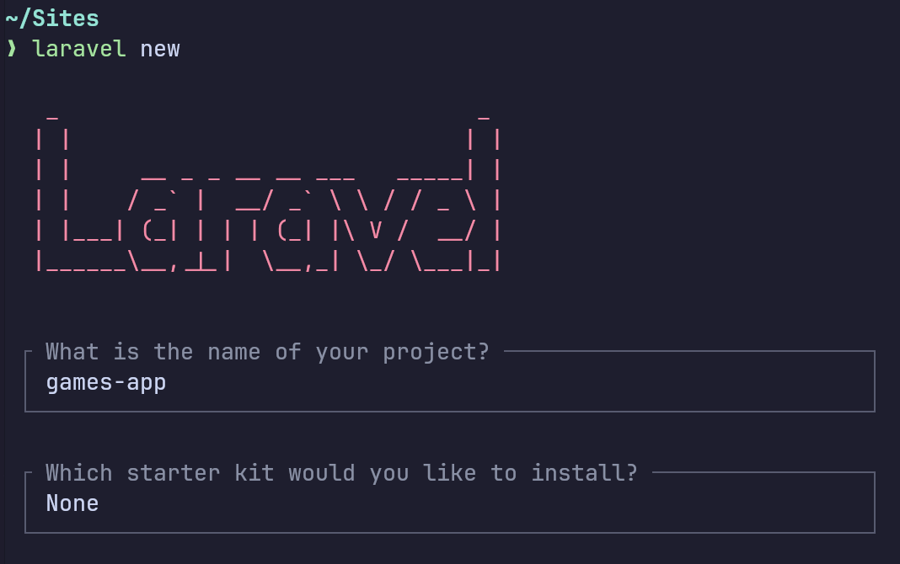
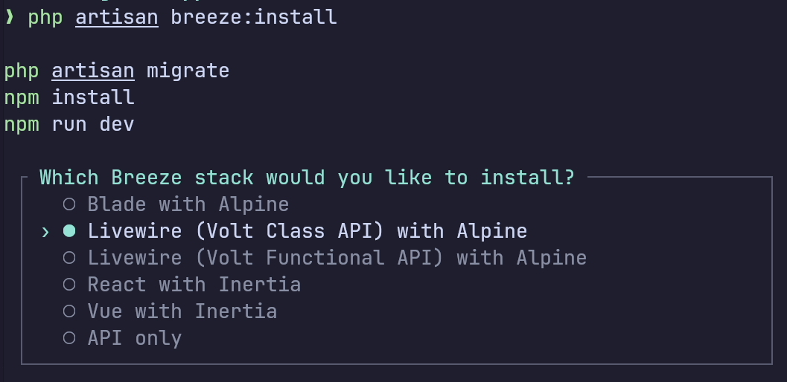
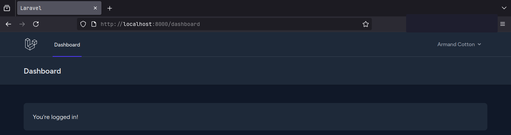

### Create Laravel app

 

### Install Laravel Breeze

[Laravel Breeze](https://laravel.com/docs/11.x/starter-kits#laravel-breeze)

```bash
composer require laravel/breeze --dev
```

```bash
php artisan breeze:install

php artisan migrate
npm install
npm run dev
```

 


### Upgrade Tailwind CSS from v3 to v4

[Upgrade guide](https://tailwindcss.com/docs/upgrade-guide)

```bash
npx @tailwindcss/upgrade
```

#### Modify `vite.config.js`

[Vite plugin](https://tailwindcss.com/docs/upgrade-guide#using-vite)

```bash
───────┬────────────────────────────────────────────────────────────────────────────
       │ File: vite.config.js
───────┼────────────────────────────────────────────────────────────────────────────
   1   │ import { defineConfig } from 'vite';
   2   │ import laravel from 'laravel-vite-plugin';
   3   │ import tailwindcss from "@tailwindcss/vite";
   4   │ 
   5   │ export default defineConfig({
   6   │     plugins: [
   7   │         laravel({
   8   │             input: ['resources/css/app.css', 'resources/js/app.js'],
   9   │             refresh: true,
  10   │         }),
  11   │         tailwindcss(),
  12   │     ],
  13   │ });
───────┴────────────────────────────────────────────────────────────────────────────
```

### Breeze appearance

```bash
composer run dev
```

 

 

